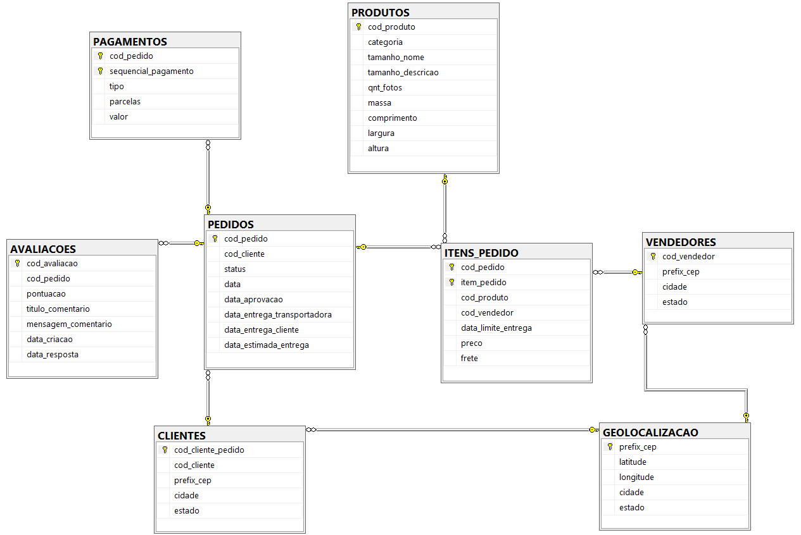
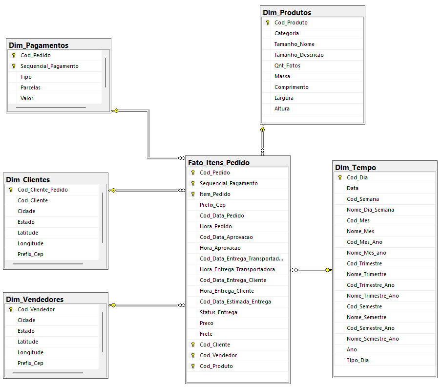

# Data-Warehouse-Olist

Este projeto tem como objetivo construir um data warehouse com base em um banco de dados relacional e comparar as diferentes abordagens de modelagem de dados. Os dados utilizados são do dataset de e-commerce disponibilizado pela Olist no Kaggle e pode ser acessado através deste <a href='https://www.kaggle.com/datasets/olistbr/brazilian-ecommerce?datasetId=55151&sortBy=voteCount&sort=votes&select=olist_geolocation_dataset.csv'>link</a>. A modelagem do banco relacional seguiu a proposta disponibilizada no Kaggle, conforme abaixo:</a>

    A partir dos arquivos CSV foi construido um ETL para a construção de um banco de dados relacional utilizando o script em Python descrito abaixo. Estabelecendo conexão com o SQL Server, foram criadas as tabelas com as devidas chaves primárias e estrangeiras , posteriormente, o tratamento de valores nulos e carregamento dos dados.

    Com o banco relacional criado, foi utilizada a ferramenta on-premise SQL Server Service Integration (SSIS) para a criação do ETL do data warehouse consumindo dados do banco de dados recém criado. O modelo lógico do data warehouse é descrito na imagem abaixo: 

    

    Após a implementação dos dois bancos com diferentes abordagem de modelagem, avaliou-se os benefícios do modelo dimensional conforme diretrizes propostas por Ralph Kimball em seu livro <a href='https://www.amazon.com.br/Data-Warehouse-Toolkit-Definitive-Dimensional-ebook/dp/B00DRZX6XS/ref=sr_1_1?qid=1668083125&refinements=p_27%3ARalph+Kimball&s=books&sr=1-1&ufe=app_do%3Aamzn1.fos.fcd6d665-32ba-4479-9f21-b774e276a678'>The Data Warehouse Toolkit: The Definitive Guide to Dimensional Modeling</a>.

  O projeto completo pode ser acessado através do <a href='https://github.com/Ribeiro-Pedro/Data-Warehouse-Olist/blob/main/Projeto%20Data%20Warehouse%20Olist.ipynb'>link</a>.

